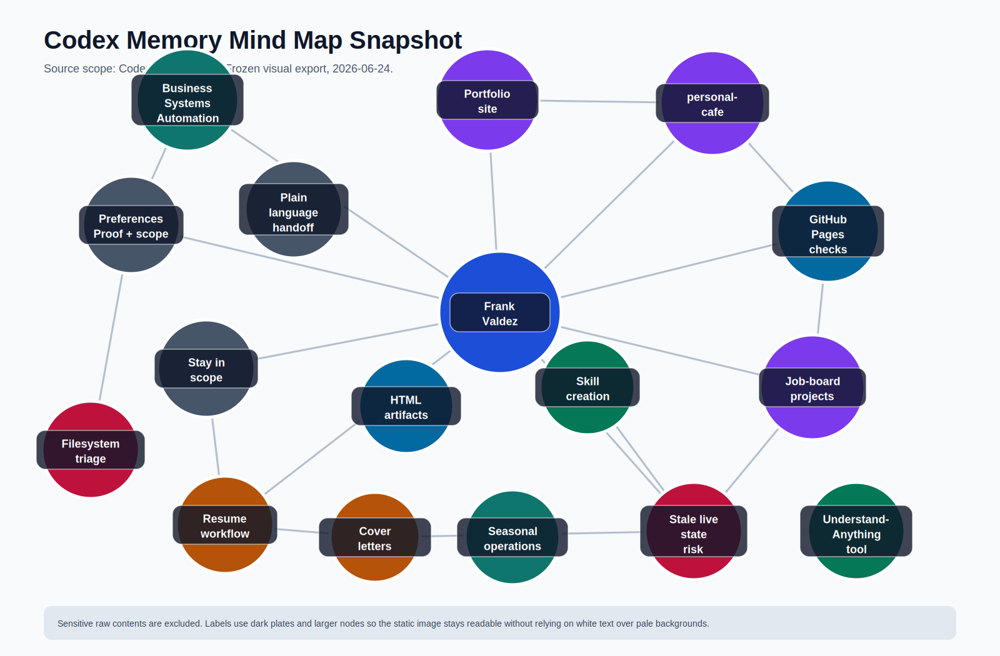

# Codex Memory Map

A source-backed map of work patterns, career direction, and recurring systems.



## What This Is

This is a public portfolio artifact built from Codex memory notes. It shows how recurring work areas connect across career direction, repos, workflows, preferences, risks, and browser-openable outputs.

The artifact is designed to show information design and repo hygiene, not private raw source material.

## Source Boundary

Included:

- Topic labels, summaries, and evidence references from `MEMORY.md`.
- Cluster and relationship metadata authored for public reading.
- A deterministic visual layout for the interactive map and SVG export.

Excluded:

- Secrets, API keys, payment data, identity document text, and raw personal document contents.
- Absolute local filesystem paths.
- Live repo, job-board, or deployed-site claims that would need fresh verification.

## Project Structure

- `data/mind-map-snapshot.json`: the source dataset.
- `src/layout.json`: deterministic graph positions and cluster territories.
- `src/styles.css`: shared visual system for the generated site.
- `src/client.js`: browser interaction logic.
- `src/build.mjs`: generates `site/` and the SVG export.
- `src/validate.mjs`: checks data integrity and public-path leakage.
- `site/`: generated interactive site.
- `exports/mind-map-snapshot.svg`: generated static preview.

## Commands

```bash
npm run validate
npm run build
npm run check
```

Open `site/index.html` in a browser after building.

## Google Analytics + gtag

The generated site includes the Google tag in `site/index.html` through `src/build.mjs`.

- Measurement ID: `G-RSVR6Y389R`
- Script source: `https://www.googletagmanager.com/gtag/js?id=G-RSVR6Y389R`
- Page title sent to GA: `frankstop/MindMap`
- Page path sent to GA: `/MindMap/`

After the GitHub Pages deploy finishes, confirm the property in Google Analytics:

1. Open Google Analytics.
2. Go to Admin.
3. Select the property that owns `G-RSVR6Y389R`.
4. Open Data Streams and choose the web stream.
5. Confirm the stream URL matches the MindMap GitHub Pages URL.
6. Open Reports > Realtime.
7. In the Realtime card, change the dimension from `Country` to `Page title and screen name`.
8. Visit the deployed MindMap page in a browser and confirm `frankstop/MindMap` appears.

If the stream URL is still pointed at another project, keep the same measurement ID only if this site should report into that shared property. Create a new web stream if MindMap needs separate reporting.

## Design Intent

The first screen should read as a designed information product:

- Frank Valdez is the central topic.
- Career, repos, workflows, preferences, risks, and artifacts have visible territories.
- Search is the primary control.
- Filters and reset actions stay quiet.
- Red is reserved for risk.
- The inspector explains the selected topic with evidence lines.

## Acceptance Checklist

- `data/mind-map-snapshot.json` is the only maintained data source.
- `site/index.html` and `exports/mind-map-snapshot.svg` are generated outputs.
- The public UI and README contain no absolute local paths.
- The SVG preview and interactive site tell the same story.
- Search, cluster filtering, link filtering, reset, mouse selection, and keyboard selection work.
